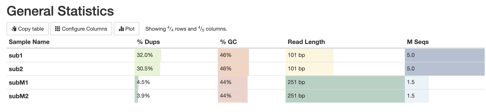
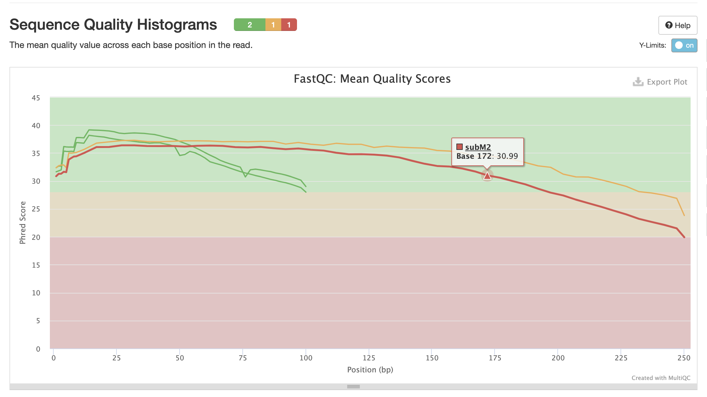
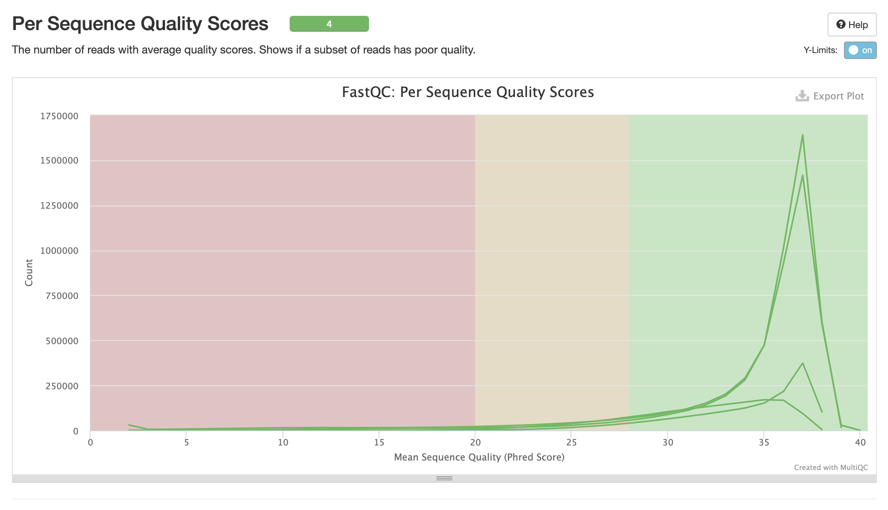
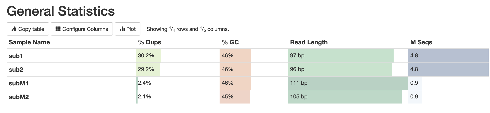
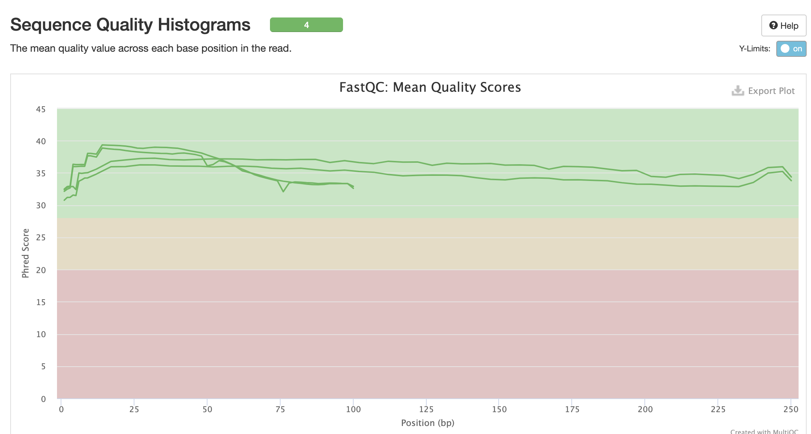
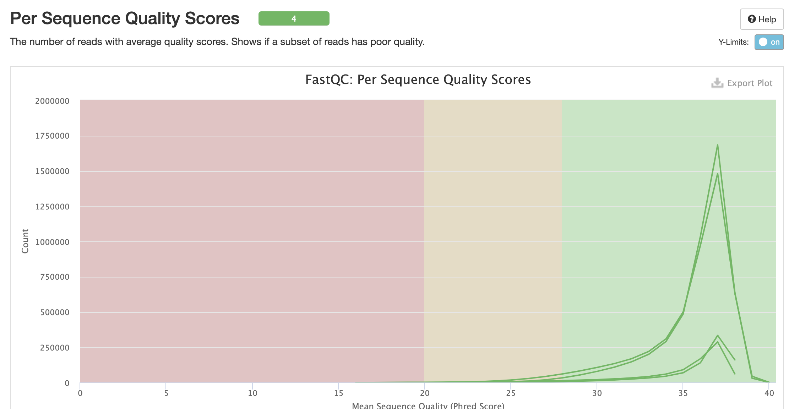

# hse22_hw1

Создадим папку для ДЗ:

```bash
mkdir hw1
cd hw1
```

Создадим симлинки: 

```
ln -s /usr/share/data-minor-bioinf/assembly/oil_R1.fastq
ln -s /usr/share/data-minor-bioinf/assembly/oil_R2.fastq
ln -s /usr/share/data-minor-bioinf/assembly/oilMP_S4_L001_R1_001.fastq
ln -s /usr/share/data-minor-bioinf/assembly/oilMP_S4_L001_R2_001.fastq
```

С помощью команды seqtk выбирем случайно 5 миллионов чтений типа paired-end и 1.5 миллиона чтений типа mate-pairs:


```bash
seqtk sample -s1217 oil_R1.fastq 5000000 > sub1.fastq
seqtk sample -s1217 oil_R2.fastq 5000000 > sub2.fastq
seqtk sample -s1217 oilMP_S4_L001_R1_001.fastq 1500000 > subM1.fastq
seqtk sample -s1217 oilMP_S4_L001_R2_001.fastq 1500000 > subM2.fastq
```

С помощью программы fastQC и multiQC оценим качество исходных чтений и получим по ним общую статистику:

```bash
mkdir f_result
fastqc sub1.fastq sub2.fastq subM1.fastq subM2.fastq -o f_result
multiqc f_result -o m_result
```





Подробнее тут: `multiqc_repot.html`

Подрежем чтения по качеству и удалим адаптеры:

```bash
platanus_trim sub1.fastq sub2.fastq
```
```
Number of trimmed read with adapter: 
NUM_OF_TRIMMED_READ(FORWARD) = 209521
NUM_OF_TRIMMED_BASE(FORWARD) = 207971
NUM_OF_TRIMMED_READ(REVERSE) = 209563
NUM_OF_TRIMMED_BASE(REVERSE) = 356379
NUM_OF_TRIMMED_PAIR(OR) = 209586
NUM_OF_TRIMMED_PAIR(AND) = 209498


Number of trimmed read because of low quality or too short (< 11bp): 
NUM_OF_TRIMMED_READ(FORWARD) = 909239
NUM_OF_TRIMMED_BASE(FORWARD) = 18150701
NUM_OF_TRIMMED_READ(REVERSE) = 1179319
NUM_OF_TRIMMED_BASE(REVERSE) = 35941404
NUM_OF_TRIMMED_PAIR(OR) = 1631400
NUM_OF_TRIMMED_PAIR(AND) = 457158
```

```
platanus_internal_trim subM1.fastq subM2.fastq
```
```
Number of trimmed read with internal adapter: 
NUM_OF_TRIMMED_READ(FORWARD) = 971779
NUM_OF_TRIMMED_BASE(FORWARD) = 169619175
NUM_OF_TRIMMED_READ(REVERSE) = 956563
NUM_OF_TRIMMED_BASE(REVERSE) = 171443180
NUM_OF_TRIMMED_PAIR(OR) = 1188187
NUM_OF_TRIMMED_PAIR(AND) = 740155


Number of trimmed read with adapter: 
NUM_OF_TRIMMED_READ(FORWARD) = 11102
NUM_OF_TRIMMED_BASE(FORWARD) = 365945
NUM_OF_TRIMMED_READ(REVERSE) = 11122
NUM_OF_TRIMMED_BASE(REVERSE) = 383522
NUM_OF_TRIMMED_PAIR(OR) = 11126
NUM_OF_TRIMMED_PAIR(AND) = 11098


Number of trimmed read because of low quality or too short (< 11bp): 
NUM_OF_TRIMMED_READ(FORWARD) = 361046
NUM_OF_TRIMMED_BASE(FORWARD) = 11715600
NUM_OF_TRIMMED_READ(REVERSE) = 468940
NUM_OF_TRIMMED_BASE(REVERSE) = 23923708
NUM_OF_TRIMMED_PAIR(OR) = 724843
NUM_OF_TRIMMED_PAIR(AND) = 105143
```

Удалим исходные .fastq файлы, полученные с помощью программы seqtk:

```bash
rm sub1.fastq sub2.fastq subM1.fastq subM2.fastq
```

Оцениваем качество подрезанных чтений:

```bash
mkdir f_trimmed
fastqc sub1.fastq.trimmed sub2.fastq.trimmed subM1.fastq.int_trimmed subM2.fastq.int_trimmed -o f_trimmed
multiqc f_trimmed -o m_trimmed
```





Подробнее тут: `multiqc_repot_trimmed.html`

Контиги:

```
platanus assemble -f sub1.fastq.trimmed sub2.fastq.trimmed -o sub
```

Скаффолды:
```
platanus scaffold -c sub_contig.fa -b sub_contigBubble.fa -IP1 sub1.fastq.trimmed sub2.fastq.trimmed -OP2 subM1.fastq.int_trimmed subM2.fastq.int_trimmed -o sub
```

Сокращаем гэпы:

```
platanus gap_close -c sub_scaffold.fa -IP1 sub1.fastq.trimmed sub2.fastq.trimmed -OP2 subM1.fastq.int_trimmed subM2.fastq.int_trimmed -o sub
```
Удаляем ненужные файлы:

```bash
rm *.trimmed
```


 
 
